<!-- ═══════════════════════════════════════════════════════════════ -->
<!--                          HEADER                                -->
<!-- ═══════════════════════════════════════════════════════════════ -->

<div align="center">



</div>

<div align="center">

<br/>

<a href="https://mortoti.me"></a>
<a href="https://linkedin.com/in/mortoti"></a>
<a href="mailto:mortoti.dev@gmail.com"></a>


</div>


<br/>

<!-- ═══════════════════════════════════════════════════════════════ -->
<!--                          WHOAMI                                -->
<!-- ═══════════════════════════════════════════════════════════════ -->

<div align="center">

### `~/whoami`

<br/>



</div>

<details>
<summary><sub>plain text version, for terminals that hate fun</sub></summary>

```
                                            +***
                                  +***#**########*+
                               +***+======-====++**#*+
                            ***+==-----:::-::::--===+*#*
                          +#*----==+++======-----:::--=**+
                         #+---+*#%%%@@%%%%%%%%%##*+==-:==+*
                        *===*%%@@%%@@@@@@@@@@@@@@@@%%#+-==+*
                       *+=+#@@%%%%%%%%%%@@%%%%%%%%%@@@@*===++
                       *+++%%%%%%%%%%%%%@@@%%%%%%%%%%%%%+===*
                       +==*%%%%@@@@@@@@@@@@@@@@@@@@@%%%%#+--=
                       =-*%%%%%########%%%%##*****##%%%%%#+-==
                       =-#%%#**+**+==++*****++==+****#%%%%*-=
                       *=###+++=+======+##*+==-===+=+**##%+-*
                       +*##*+*=====+++*#@@%*++++====+***###**=
                       +*###%%%%##%%%%@@@@@@%%%%%#%%%%####***
                       +*#%%%%@@@@%#@@@%@@%%@@%#%@@@@@%%%#++#
                        ##%%%####*+*#*++*#+=+**++#####%%%#*#+
                        +###******##+==+++++==+*++****###**#
                         *#***++***##*##***#****==++****##
                         ***++++++====+****++===-=+++++**#
                         *=+*++**+==+*#%%%%##*++++**+***=#
                          =-=+*********##******##***++=-=
                           =--=+*+++++++===++*****+==-:-=
                            =::-===+++*********+==--::-
                             +-::----=++++++==-:::::-++
                             *+=--::::::::::::::::--=*+
                            +*+===---:::::::::::---==+**
                          *##+======-------------====+*%##*
                       *%@%#*++=======-----------=====*##%%%@%**
                  +*###*#####*++========---------====+*#%%%%#***#%#*
               +#%###%###*++**+++++=============+++**##%##******###%%%#*
            *#%%%**#####%#*+++=====---=-========++****+++++*****#%###%%%%%#*
```

</details>

<div align="center">

</div>

```python
# mortoti.py  ·  run me

class Mortoti:
    name     = "Jephthah Lorlornyo Mortoti-Agogyi"
    company  = "NOLAP Technologies :: Systems | Academy | Agency"
    studying = "BSc Information Technology @ KNUST"

    stack = {
        "languages" : ["Python", "Java", "JavaScript", "C++"],
        "frameworks": ["Django", "Django REST Framework"],
        "databases" : ["PostgreSQL", "MySQL"],
        "tools"     : ["Git", "OpenAI API", "Paystack", "Arkesel SMS"],
        "infra"     : ["Railway", "Render", "DigitalOcean", "Vercel"],
    }

    learning = ["System Design", "Robust API Architecture", "Advanced Java"]
    motto    = "Ship. Learn. Repeat."

    def available_for(self):
        return ["collaborations", "backend projects", "consulting"]


>>> Mortoti().available_for()
['collaborations', 'backend projects', 'consulting']  # scroll down
```

<br/>


<br/>

<!-- ═══════════════════════════════════════════════════════════════ -->
<!--                          ARSENAL                               -->
<!-- ═══════════════════════════════════════════════════════════════ -->

<div align="center">

### `~/arsenal`

<br/>


<br/><br/>

<br/><br/>


<br/><br/>


</div>

<br/>


<br/>

<!-- ═══════════════════════════════════════════════════════════════ -->
<!--                          SHIPPED                               -->
<!-- ═══════════════════════════════════════════════════════════════ -->

<div align="center">

### `~/shipped`

**Not side projects. Not tutorials. Production systems with real users and real money moving through them.**

<br/>



<sub>every card below opens. every link below is live.</sub>

</div>

<br/>

<div align="center">

<br/>
<sub>AI powered study platform for Ghanaian university students</sub>
</div>

<details open>
<summary><b>Read the breakdown</b> &nbsp;<code>700+ active students</code> &nbsp;<code>django</code> <code>openai</code> <code>paystack</code></summary>

<br/>

> Students here revise the same way every year. They hunt for past questions, photocopy whatever they can find, and hope the lecturer repeats himself. NOLAP Prep replaces that guesswork with a system.

```console
$ nolap-prep --features

  question generation   course material in, fresh exam style questions out
  live quizzes          students go head to head in real time
  study reminders       SMS that lands on any phone, no data required
  payments              Paystack subscriptions, cards and mobile money
  class resources       one home for every slide, note and material
```

Question generation is the core. Instead of the same three past papers circling a WhatsApp group, students get an unlimited supply of practice drawn from their own course material through the OpenAI API. The competitions turn solo revision into something they come back for, and the SMS layer means a student with no data still gets nudged.

Django and PostgreSQL underneath. More than 700 students on it.

<br/>


<a href="https://nolapprep.com"></a>

</details>

<br/>

<div align="center">

<br/>
<sub>Point of sale and loyalty engine for a working barbershop</sub>
</div>

<details open>
<summary><b>Read the breakdown</b> &nbsp;<code>queue, payroll, referrals</code> &nbsp;<code>django</code> <code>momo</code> <code>sms</code></summary>

<br/>

> A barbershop is harder than it looks. Customers arrive without warning, barbers are paid on what they cut, and the whole thing usually runs on a notebook behind the counter. Imperial Corte turns that notebook into software.

```console
$ imperial-corte --features

  queue management      who is waiting, who is in a chair, who is next
  barber commissions    calculated from recorded cuts, not from memory
  payroll               paying the team becomes a report, not an evening
  sms blasts            promotions to the whole customer base at once
  birthday automation   every customer hears from the shop on their day
  imperialcash          referrers earn cash on every visit they cause
```

**ImperialCash** is the piece I am proudest of. A member earns real mobile money every single time someone they referred walks in and pays. Not points. Not a stamp card. Cash that lands on their phone.

It turns every satisfied customer into a salesperson with a reason to care, so growth compounds instead of waiting on foot traffic.

<br/>


<a href="https://imperialcorte.com"></a>

</details>

<br/>

<div align="center">

<br/>
<sub>Official website for a national government body</sub>
</div>

<details open>
<summary><b>Read the breakdown</b> &nbsp;<code>all 16 regions</code> &nbsp;<code>django</code> <code>postgres</code></summary>

<br/>

> The Ghana Association of Assembly Members represents assembly members across all 16 regions of the country. Assembly members are the tier of government closest to ordinary people, and until this project the association had no official home online.

```console
$ gaam --about

  scope        national body, all 16 regions of Ghana
  represents   assembly members, the tier closest to the public
  launched     an official milestone under the current president
  audience     members, media and the public, on any connection
  status       live and public record
```

Building for a national body changes the job. The audience is not early adopters who forgive a rough edge. It is members, journalists and citizens arriving from every region on every kind of connection, many of them using the internet for something official for the first time.

That pushed the weight onto clear structure, fast pages, and content that survives being read by someone who is not going to hunt for what they need.

<br/>


<a href="https://gaamofficial.org"></a>

</details>

<br/>

<div align="center">

<br/>
<sub>University admissions platform</sub>
</div>

<details open>
<summary><b>Read the breakdown</b> &nbsp;<code>171 programmes indexed</code> &nbsp;<code>django</code> <code>paystack</code> <code>sms</code></summary>

<br/>

> Every year thousands of Ghanaian students finish WASSCE and hit the same wall. What is my aggregate. Which universities will take it. Which programmes am I actually qualified for. The answers sit scattered across PDFs, notice boards and rumour.

```console
$ sir-ray-consult --features

  aggregate calculator  WASSCE grades in, the number that decides out
  cut off points        indexed for every Ghanaian university
  programme catalogue   171 programmes with their entry requirements
  course match          your results in, the programmes you qualify for
  result checker cards  bought and delivered over SMS in seconds
```

Course Match is the feature that turns a reference site into advice. A student stops browsing requirements and starts seeing the shortlist that is actually open to them.

The result checker cards are the part that earns. A student can buy one at midnight through Paystack and have it delivered by SMS immediately, instead of finding a vendor in town the next morning. The tools bring students in, the cards pay for the platform.

<br/>


<a href="https://sirrayconsult.com"></a>

</details>

<br/>

<div align="center">

<br/>
<sub>Church management system for a full congregation</sub>
</div>

<details open>
<summary><b>Read the breakdown</b> &nbsp;<code>records, attendance, finances</code> &nbsp;<code>django</code> <code>sms</code></summary>

<br/>

> Membership in one book, attendance in another, offerings in a third, and announcements delivered by whoever remembered to make them. It all worked until someone needed to answer a question that spanned two of those books.

```console
$ aci-abrepo --features

  member records        the congregation in one searchable database
  attendance            who shows up, and who has quietly stopped
  finances              recorded and reportable, figures not estimates
  day born groups       built around the Akan day name groupings
  bulk sms              the whole congregation reached at once
```

Attendance here is pastoral information, not a statistic. A name that stops appearing is a person to check on, and the system surfaces that instead of burying it in a register nobody adds up.

Day born groups are the part no off the shelf church software accounts for, because it is a structure that only makes sense here. Building for volunteers meant the whole thing had to be obvious on the first try, with nobody available to train them.

<br/>


<a href="https://arkcathedral.com"></a>

</details>

<br/>


<br/>

<!-- ═══════════════════════════════════════════════════════════════ -->
<!--                          RECEIPTS                              -->
<!-- ═══════════════════════════════════════════════════════════════ -->

<div align="center">

### `~/receipts`

<br/>



</div>

<br/>


<br/>

<!-- ═══════════════════════════════════════════════════════════════ -->
<!--                          STATS                                 -->
<!-- ═══════════════════════════════════════════════════════════════ -->

<div align="center">

### `~/stats`

<br/>


<br/><br/>


</div>

<br/>

<div align="center">


</div>

<br/>


<br/>

<!-- ═══════════════════════════════════════════════════════════════ -->
<!--                          TROPHIES                              -->
<!-- ═══════════════════════════════════════════════════════════════ -->

<div align="center">

### `~/achievements`

<br/>



</div>

<details>
<summary><sub>plain text version</sub></summary>

```
$ cat achievements.log --sort=recent

01   MTN SME ACCELERATE WINNER
     GHS 30,000 in pitch funding  ·  April 2026

02   FIRST CLASS
     BSc Information Technology, KNUST  ·  CWA 71.92

03   HONORS ADMISSION
     Kent State University, USA  ·  Ohio University, USA

04   MOST IMPROVED PROGRAMMER
     Computer Science Society, KNUST  ·  2025

05   MOST INFLUENTIAL STUDENT
     High School Excellence Awards  ·  2024

06   EXCELLENT LEADERSHIP AWARD
     Presec Legon Speech Day  ·  2024  ·  GHS 1,000 prize

6 records returned  ·  0 pending  ·  still shipping
```

</details>

<br/>


<br/>

<!-- ═══════════════════════════════════════════════════════════════ -->
<!--                          CONTACT                               -->
<!-- ═══════════════════════════════════════════════════════════════ -->

<div align="center">

### `~/contact`

<br/>



<br/><br/>

<a href="https://linkedin.com/in/mortoti"></a>
&nbsp;
<a href="mailto:mortoti.dev@gmail.com"></a>
&nbsp;
<a href="https://mortoti.me"></a>
&nbsp;
<a href="https://youtube.com/@mortoti"></a>

<br/><br/>


<sub>built in Kumasi &nbsp;·&nbsp; shipped to the world</sub>

</div>
